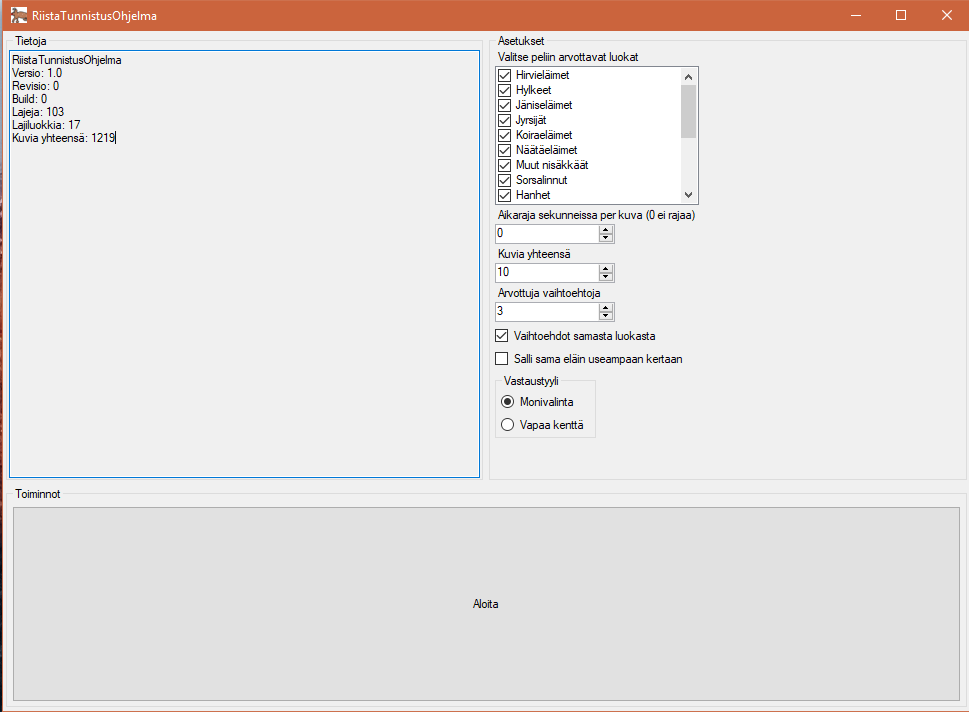

## Riistatunnistus

Windows desktop-ohjelma jonka kirjoitin metsästäjäntutkinnon lajintunnistuksen
harjoittelua varten. Kirjoitettu C#-kielellä, käyttää natiivia WinForms-rajapintaa.

*Backend* sisältää pelilogiikan, 'Frontend' *RiistaTunnistusOhjelma*-kansion alla
erillinen DLL joka hoitaa käyttöliittymäpuolen.

Kuvat haettu netistä joten niitä ei sisällytetty. Käytännössä vaatii kuvien
hakemisen ja tallentamisen lajeja vastaavien kansioiden alle *data/elaimet/X*
rakenteeseen jossa *X* on *data.json* tiedostossa määritelty kansio.

Monivalinta tai vapaa kenttä, aikarajan ja arvotut lajit ym. voi säätää.

